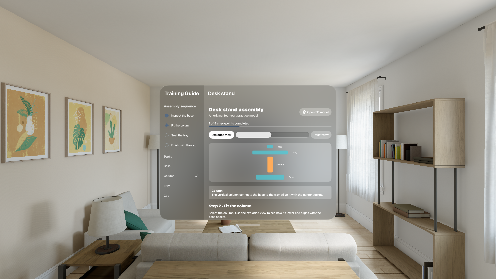
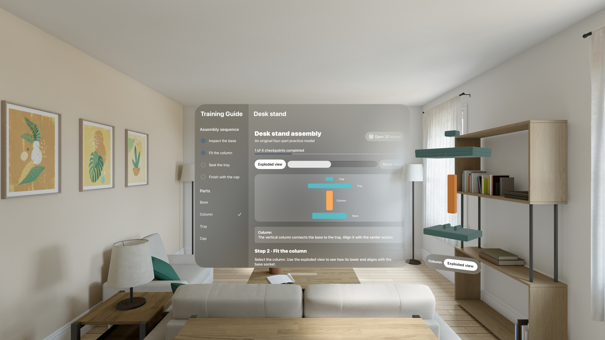

# Spatial Training Guide

A native visionOS practice lesson for assembling an original four-part desk stand. Inspect the parts in a spatial volume, compare exploded and assembled views, and complete guided checkpoints with persistent progress.

## Run

Open **Spatial Training Guide.xcodeproj** in Xcode 27 and select the **Spatial Training Guide** scheme. Run on the visionOS 27 simulator, or choose your own development team for Apple Vision Pro. The bundle ID is `com.dd.spatialtrainingguide`; no developer team is stored in the project.

1. Select **Open 3D model** to show the stand in a volume beside the lesson window.
2. Select a part with gaze and pinch, or use the accessible **Parts** list in the lesson window.
3. Toggle **Exploded view**, rotate the model, and inspect how the parts fit. The diagram provides a simplified cross-section when a volume is inconvenient.
4. Answer the current knowledge question and choose **Check checkpoint**. A checkpoint requires the correct part and answer, in sequence.
5. Quit and reopen to resume. **Restart practice** asks before resetting the local record.

## Scope

The stand, geometry, lesson text, questions, and layered icon are original and included under MIT. This is a reusable example of spatial instruction and in-app knowledge checks. Completion records practice; it is not a certification, safety qualification, or physical assembly inspection.

This version does not track physical objects or use a trained reference-object model. Reliable real-object tracking requires a suitable physical object, a trained reference asset, and device validation; none is fabricated or bundled as a placeholder. The app also does not request camera, room-mapping, or hand-tracking data.

## Engineering

- SwiftUI window and volumetric scenes, RealityKit geometry, native ornaments, hover/input components, and alternative part-selection controls.
- Main-actor observable state and actor-isolated, atomic progress storage with bounded decoding and stale-write rejection.
- Explicit checkpoint state transitions, durable saves before advancing, useful validation feedback, and recovery from invalid saved data without modifying it during reads.
- No third-party dependencies, network service, account system, or embedded signing identity.

```sh
swift test
swift test -c release
xcodebuild -project 'Spatial Training Guide.xcodeproj' -scheme 'Spatial Training Guide' -configuration Release -destination 'generic/platform=visionOS Simulator' CODE_SIGNING_ALLOWED=NO build
bash Scripts/test-ui.sh
```

[Verification](Docs/Verification.md) records performed checks and device limits. See [privacy](PRIVACY.md) and [contributing](CONTRIBUTING.md). MIT licensed.

References: [visionOS design](https://developer.apple.com/design/human-interface-guidelines/designing-for-visionos) and [RealityKit](https://developer.apple.com/documentation/realitykit).

## Native workflow




